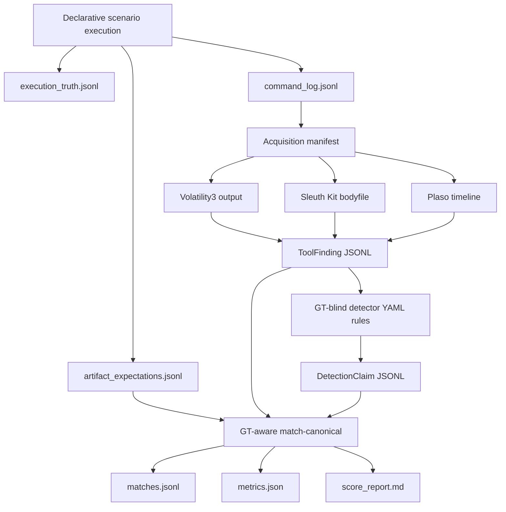
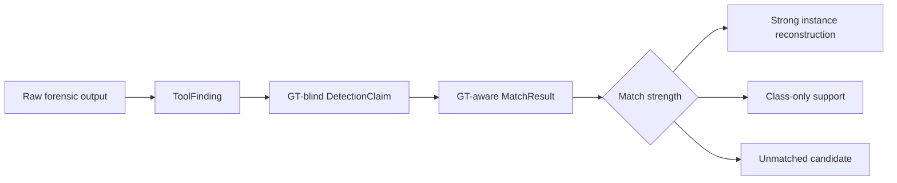

# Canonical Pipeline Review

Status: current implementation review for the canonical/declarative
`Father_LDPRELOAD` path. This document describes what the repository does now,
not an ideal architecture.

Inspected code and artifacts:

- `cli.py`
- `orchestrator/scenarios/run_context.py`
- `orchestrator/core/orchestrator.py`
- `orchestrator/adapters/common.py`
- `orchestrator/adapters/sleuthkit/bodyfile.py`
- `orchestrator/adapters/volatility3/json_output.py`
- `orchestrator/adapters/plaso/jsonl.py`
- `detectors/engine.py`
- `detectors/rules/`
- `matcher/engine.py`
- `orchestrator/canonical/models.py`
- `shared/experiments/ubuntu-22.04_userland_father_ldpreload_20260618-183143/`

## Current Flow



The canonical path is an offline post-mortem evaluation path. It does not model
live telemetry, a production detector, or a SIEM/EDR pipeline.

## Files Consumed

For the cached Father run, the current canonical evaluation consumes:

- `dumps/artifact_expectations.jsonl`: expected artifacts generated by the
  declarative scenario. This is ground truth for matching and metrics.
- `analysis/tool_findings.jsonl`: normalized raw evidence from disk, memory, and
  timeline extraction.
- `analysis/detection_claims.jsonl`, or a regenerated equivalent: GT-blind
  candidate evidence emitted by detector YAML rules.

The offline commands are:

```bash
.venv/bin/python cli.py run-detectors \
  --findings shared/experiments/ubuntu-22.04_userland_father_ldpreload_20260618-183143/analysis/tool_findings.jsonl \
  --out /tmp/flab-doc-review/father-current/detection_claims.jsonl

.venv/bin/python cli.py match-canonical \
  --expectations shared/experiments/ubuntu-22.04_userland_father_ldpreload_20260618-183143/dumps/artifact_expectations.jsonl \
  --tool-findings shared/experiments/ubuntu-22.04_userland_father_ldpreload_20260618-183143/analysis/tool_findings.jsonl \
  --detection-claims /tmp/flab-doc-review/father-current/detection_claims.jsonl \
  --out-dir /tmp/flab-doc-review/father-current/match
```

`match-canonical` can run without detection claims only with
`--debug-raw-findings`. That mode is explicitly debug-only and not a thesis
metric path.

The ignored cached `analysis/detection_claims.jsonl` from the original Father
experiment may still contain the pre-memory-dedup stream with 266 candidate
claims and 256 candidate false positives. Current code regenerates 255 candidate
claims and 245 candidate false positives from the same cached `tool_findings`
input. Use the regenerated detector/matcher outputs for thesis-relevant
numbers.

## Files Produced

Scenario and acquisition outputs:

- `command_log.jsonl`
- `execution_truth.jsonl`
- `artifact_expectations.jsonl`
- `reference_context.json`
- `manifest.json`
- memory image and disk image under `dumps/`

Analysis and evaluation outputs:

- `vol3.json`
- `bodyfile`
- `timeline.jsonl`
- `tool_findings.jsonl`
- `detection_claims.jsonl`
- `matches.jsonl`
- `metrics.json`
- `score_report.md`

## Where ToolFinding Objects Come From

`ToolFinding` records are generated by canonical adapters:

- Disk/filesystem: `orchestrator/adapters/sleuthkit/bodyfile.py` converts
  Sleuth Kit bodyfile rows to `ToolFinding` records with `source_type=disk`.
- RAM: `orchestrator/adapters/volatility3/json_output.py` converts Volatility3
  plugin rows to `ToolFinding` records with `source_type=memory`.
- Timeline: `orchestrator/adapters/plaso/jsonl.py` converts Plaso JSONL events
  to `ToolFinding` records with `source_type=timeline`.

`orchestrator/core/orchestrator.py` collects these channels. Disk and timeline
findings are scoped to the scenario command-log time window. Memory findings are
kept because they are point-in-time observations.

The current cached Father run has 7608 `ToolFinding` records:

- disk: 32
- memory: 4112
- timeline: 3464

## Where DetectionClaim Objects Come From

`detectors/engine.py` loads YAML rules from `detectors/rules/` and runs them
over `ToolFinding` records only. These rules are GT-blind. They do not load
`artifact_expectations.jsonl`, `execution_truth.jsonl`, scenario step truth, or
expected paths.

`DetectionClaim` means candidate/supporting evidence. It is not a final verdict.
The current detector layer emits broad candidate evidence for later matching.

The current implementation also collapses duplicate Volatility-derived memory
correlation candidates for:

- `flab.memory.process_library_correlation`
- `flab.memory.process_socket_correlation`

For the current Father validation, this changed memory candidate counts from:

| rule | before | after |
|---|---:|---:|
| process/library correlation | 10 | 1 |
| process/socket correlation | 4 | 2 |

Overall `DetectionClaim` count changed from 266 to 255.

## Where Matching Happens

`matcher/engine.py` performs canonical matching through `run_matcher_files()`.
It loads:

- `ArtifactExpectation` records from `artifact_expectations.jsonl`
- `ToolFinding` records from `tool_findings.jsonl`
- `DetectionClaim` records from `detection_claims.jsonl`

It projects each `DetectionClaim` into an internal `Candidate`, links source
findings by ID, and greedily matches candidates to expectations.

Matching uses:

- artifact class compatibility
- source compatibility
- ATT&CK compatibility when both sides provide ATT&CK tags
- instance-level fields such as path, socket, process, PID, SHA-256, and time
- class/context compatibility for weaker support matches

The matcher writes:

- `matches.jsonl`
- `metrics.json`
- `score_report.md`

## Where Ground Truth Is Used

Ground truth is used in two places:

- Explicit scenario truth generation: the declarative scenario writes
  `execution_truth.jsonl` and `artifact_expectations.jsonl`.
- GT-aware evaluation: `match-canonical` reads `artifact_expectations.jsonl` for
  matching, metrics, and report generation.

Ground truth is not used by adapters or detector rules in the canonical path.
This GT-blind boundary is methodologically important and should remain a thesis
claim.

## Evidence Layers



Current terminology:

- `ToolFinding`: broad raw evidence from disk, RAM, or timeline extraction.
- `DetectionClaim`: GT-blind candidate/supporting evidence from rules.
- `MatchResult`: GT-aware relation between a candidate and an expected artifact.
- Reconstruction evidence: matched expectations, especially strong
  instance-level matches.
- Class-only/support matches: useful context, but weaker than concrete
  instance-level reconstruction.

## Current Methodological Strengths

- The pipeline is explicitly post-mortem: it works from acquired disk, memory,
  and timeline artifacts.
- GT-blind candidate generation is separated from GT-aware matching.
- Raw `ToolFinding` fallback is blocked for normal thesis scoring and labeled
  debug-only.
- Reports now distinguish raw findings, candidate claims, strong instance
  matches, class-only support, unmatched candidates, diagnostics, and final
  reconstruction metrics.
- Memory correlation deduplication reduces repeated Volatility rows without
  using ground truth.
- The VM power-state contract is preserved by the acquisition layer: memory is
  acquired while the VM is on; disk is acquired after shutdown/offline
  preparation.

## Current Methodological Weaknesses

- Candidate precision remains poor. For the current Father validation:
  candidate precision is 0.0392 with 245 unmatched candidate claims.
- Timeline and filesystem rules are broad and noisy. They are valid as candidate
  evidence, but not as final reconstruction claims.
- Class-only matches still depend on permissive class/source/ATT&CK
  compatibility. They are now separated, but their interpretation remains weak.
- Baseline-aware filtering is not implemented in the canonical metric path.
  There is case-window filtering, but not clean-baseline comparison.
- Scenario-flavored detector tokens, including `father`, still exist in rule
  parameters. They are a known limitation and should not be presented as a
  general detector design.
- Some expected-artifact fields are not used for instance matching. For example,
  an expectation can contain `argv_contains`, but current matcher instance logic
  does not consume that key.
- The final reconstruction layer is still report-derived. There is no persisted
  final reconstruction artifact separate from `matches.jsonl`.
- Runtime metrics for the full pipeline are not emitted as canonical metrics.

## What Should Not Be Claimed Yet

Do not claim that the current system is a high-precision detector.

Do not claim that `DetectionClaim` records are final reconstruction results.

Do not claim that class-only matches prove concrete artifact reconstruction.

Do not claim baseline-diff filtering, known-good filtering, or package integrity
checking as implemented in the canonical path.

Do not claim end-to-end pinned thesis metrics are complete. The current metrics
are useful diagnostics and a partial final reconstruction view, but the pinned
metric vocabulary still needs cleanup.

Do not claim the legacy ART/scenario_01 path is the thesis pipeline.

## Methodology Checklist

- [x] GT is not used before matching in the canonical detector path.
- [x] Raw `ToolFinding` fallback is debug-only.
- [x] `DetectionClaim` is candidate/supporting evidence only.
- [x] Class-only matches are separated from strong instance matches.
- [x] Final thesis metrics are not silently based on raw detector output.
- [ ] Baseline-aware filtering is still missing.
- [ ] Scenario-flavored detector tokens are still a known limitation.
- [ ] Timeline/filesystem broad rules are still noisy.
- [x] Legacy ART/scenario_01 path is not the thesis path.

## Intentionally Unchanged Areas

- No detector rules were tuned.
- No baseline-aware filtering was added.
- No new tools, CLI commands, helper scripts, or abstractions were added.
- Legacy ART/scenario_01 code was not reviewed beyond confirming it is not the
  canonical thesis path.
