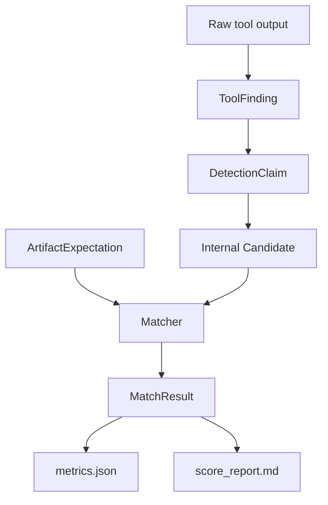

# Canonical Pipeline Schema

This document describes the current data model and field usage in the
canonical/declarative pipeline. It does not propose a new schema.

## Lifecycle

## ArtifactExpectation

Source: `orchestrator/canonical/models.py`.

Produced by declarative scenario execution through
`orchestrator/scenarios/run_context.py`.

Important fields currently used:

| field | current use |
|---|---|
| `ae_id` | Stable target ID used in `MatchResult.target_id`. |
| `scenario_id` | Run/scenario context and fallback run ID derivation. |
| `step_id` | Scenario step context; can participate in weak class-context matching. |
| `artifact_class` | Primary expected artifact class for matching. |
| `observable_kind` | Descriptive. Not directly used by matcher scoring. |
| `source_eligibility` | Allowed evidence sources for a candidate match. |
| `persistence` | Descriptive. Not directly used by matcher scoring. |
| `observability` | Descriptive today; useful for future gap analysis. |
| `instance_constraints` | Concrete expected values for path, socket, process, PID, SHA-256, time, etc. |
| `critical` | Used for `critical_recall`. |
| `attck` | Used for ATT&CK compatibility when both expectation and candidate have tags. |
| `temporal_quality` | Stored but not central to match scoring. |
| `notes` | Report context only. |

Important limitation: `instance_constraints` is an open dictionary. The matcher
currently looks for only selected keys. Fields such as `argv_contains` can exist
but are not currently consumed by instance matching.

## ToolFinding

Source: `orchestrator/canonical/models.py`.

Produced by canonical adapters from disk, RAM, and timeline outputs.

Important fields currently used:

| field | current use |
|---|---|
| `finding_id` | Stable evidence ID. `DetectionClaim.source_findings` points back to it. |
| `run_id` | Keeps findings scoped to a run and participates in stable ID generation. |
| `tool` | Provenance and reporting context. |
| `tool_version` | Provenance. |
| `adapter_version` | Provenance and schema migration context. |
| `source_type` | Disk, memory, timeline, log, or unknown. Used by detectors, matcher source compatibility, and reports. |
| `artifact_class` | Used by detector rule selection and matcher candidate class. |
| `entity` | Main parsed evidence payload. Detectors and matcher inspect `type`, `value`, `path`, `pid`, `remote`, and similar keys. |
| `time` | Used for case-window filtering and optional instance-level time matching. |
| `raw_ref` | Provenance back to tool output row. Also participates in stable ID generation before reassignment. |
| `provenance` | Tool/plugin/input row metadata. Used for explanation, not matching. |
| `temporal_quality` | Used in temporal summaries. |

Adapter origins:

- Sleuth Kit bodyfile -> disk `ToolFinding`
- Volatility3 JSON rows -> memory `ToolFinding`
- Plaso JSONL events -> timeline `ToolFinding`

## DetectionClaim

Source: `orchestrator/canonical/models.py`.

Produced by `detectors/engine.py` from `ToolFinding` records and YAML rules.

Important fields currently used:

| field | current use |
|---|---|
| `claim_id` | Candidate ID used in matching and reports. |
| `run_id` | Run scoping. |
| `rule_id` | Rule provenance and report grouping. |
| `artifact_class` | Candidate artifact class for matching. |
| `entity` | Candidate evidence payload. Used for instance matching and memory deduplication. |
| `confidence` | Carried into internal `Candidate`; not currently decisive in matching. |
| `source_findings` | Links candidate evidence back to raw `ToolFinding` rows. Used for source attribution. |
| `attck` | Used for ATT&CK compatibility. |
| `notes` | Report explanation. |

`DetectionClaim` is candidate/supporting evidence. It is not a final verdict.

Current memory correlation deduplication adds these entity keys for collapsed
memory claims:

- `collapsed_candidate_count`
- `source_finding_count`
- `representative_source_findings`

These keys are provenance summaries, not ground-truth labels.

## Internal Candidate

Source: `matcher/engine.py`.

This is not a persisted schema. It is built from either `DetectionClaim` records
or, in debug-only mode, raw `ToolFinding` records.

Important fields:

| field | current use |
|---|---|
| `candidate_id` | Claim ID or finding ID. |
| `run_id` | Match row context. |
| `artifact_class` | Candidate class used by `_class_compatible`. |
| `entity` | Matching payload. |
| `source_types` | Derived from linked source findings. |
| `source_ids` | Source finding IDs. |
| `kind` | `claim` or `tool_finding`; appears in match notes. |
| `attck` | ATT&CK compatibility. |
| `time` | Earliest linked finding time if available. |
| `temporal_quality` | Best temporal quality from linked findings. |
| `confidence` | Preserved from claim; not a match threshold today. |

## MatchResult

Source: `orchestrator/canonical/models.py`.

Produced by `matcher/engine.py`.

Important fields:

| field | current use |
|---|---|
| `match_id` | Stable match row ID. |
| `run_id` | Run context. |
| `target_id` | Expected artifact ID, or `__none__` for unmatched candidates. |
| `finding_or_claim_id` | Candidate ID, or `__none__` for missed expectations. |
| `match_level` | `instance`, `class`, or `none`. |
| `relation` | `tp`, `fp`, or `fn`. |
| `score` | Heuristic score from matching logic. |
| `fields_matched` | Explanation fields such as `artifact_class`, `source_type`, `attck`, `path`, `pid`, or `time`. |
| `notes` | Human-readable match reason. |

Interpretation:

- `relation=tp` and `match_level=instance`: strong instance reconstruction.
- `relation=tp` and `match_level=class`: class-only/support match.
- `relation=fp`: unmatched candidate evidence.
- `relation=fn`: expected artifact with no matched candidate.

## Report and Metric Structures

`metrics.json` currently contains:

- `counts`: candidate-level TP/FP/FN.
- `micro`: candidate-level precision/recall/F1.
- `candidate_diagnostics`: explicit copy of candidate-level micro metrics.
- `final_reconstruction`: strong instance metrics where class-only support is
  not counted as a strong match.
- `reconstruction`: older instance-only and class-level coverage fields.
- `critical_recall`: recall over expectations marked `critical`.
- `source_breakdown`: raw `ToolFinding` counts by source.
- `per_source`: candidate-level PRF grouped by source.
- `per_artifact_class`: candidate-level PRF grouped by artifact class.
- `temporal_quality`: raw and matched temporal-quality counts.
- `false_positives_per_run`: unmatched candidate count by run.
- `match_levels`: count of instance and class matches.
- `candidate_input` and `debug_only`: identify normal claim mode vs debug raw-finding fallback.

`score_report.md` renders the same information in layered form:

- raw `ToolFinding` counts by source/type
- `DetectionClaim` counts by rule/source
- memory aggregation summary
- matched expectations/reconstruction evidence
- strong instance matches
- class-only/support matches
- unmatched candidates
- candidate diagnostics
- final reconstruction summary

## Field Usage In Matching

| purpose | fields currently used |
|---|---|
| Rule matching | `ToolFinding.source_type`, `ToolFinding.artifact_class`, `ToolFinding.entity`. |
| Evidence identity | `finding_id`, `claim_id`, `source_findings`, `run_id`, `entity.type`, `entity.value`, `raw_ref`. |
| Artifact class matching | `ArtifactExpectation.artifact_class`, `Candidate.artifact_class`, and hard-coded aliases in `_class_compatible`. |
| Source attribution | `ArtifactExpectation.source_eligibility`, `Candidate.source_types`, linked `ToolFinding.source_type`. |
| ATT&CK compatibility | `ArtifactExpectation.attck`, `Candidate.attck`. |
| Instance-level path matching | `instance_constraints.entity_value`, `path`, `value`, or related keys compared to `Candidate.entity.value`. |
| Instance-level socket matching | Expected socket/entity value compared with candidate socket value or remote endpoint. |
| Instance-level process matching | Expected process string compared with candidate value, path, or argv text. |
| Instance-level PID matching | `instance_constraints.pid` compared with `Candidate.entity.pid`. |
| Instance-level hash matching | `instance_constraints.sha256` compared with `Candidate.entity.sha256`. |
| Instance-level time matching | Expected `time` or `ts_utc` compared with candidate time inside `time_window_s`. |
| Class-only/support matching | Class/source compatibility plus ATT&CK compatibility or matching step context. |
| Memory claim deduplication | `DetectionClaim.run_id`, `rule_id`, `artifact_class`, `entity.type`, PID, process identity, library path, socket local/remote/value/protocol, optional expectation/artifact class fields. |

## Important Schema Limitations

- `entity` and `instance_constraints` are flexible dictionaries. This is useful
  for rapid scenario work, but weakens the contract for metrics.
- `confidence` is recorded but not yet a principled scoring input.
- Class aliases are hard-coded in matcher code, not declarative configuration.
- There is no persisted final reconstruction object. Reconstruction is derived
  from `MatchResult` rows and report sections.
- Baseline comparison is not represented as a first-class canonical source in
  the current Father metric path.
