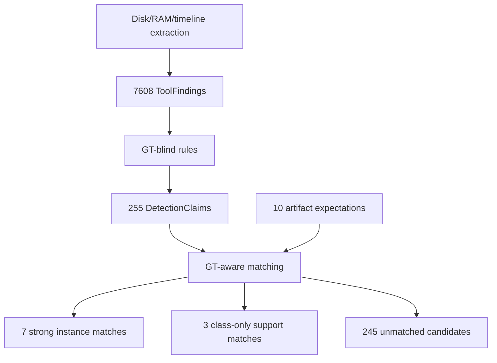

# Father LD_PRELOAD Walkthrough

This walkthrough uses the cached Father run:

`shared/experiments/ubuntu-22.04_userland_father_ldpreload_20260618-183143`

The source `tool_findings.jsonl` comes from that cached run. During this review,
current detector and matcher outputs were regenerated into `/tmp` so the
examples reflect the current code:

- `/tmp/flab-doc-review/father-current/detection_claims.jsonl`
- `/tmp/flab-doc-review/father-current/match/matches.jsonl`
- `/tmp/flab-doc-review/father-current/match/metrics.json`
- `/tmp/flab-doc-review/father-current/match/score_report.md`

The ignored cached `analysis/detection_claims.jsonl` from the original
experiment can still show the older pre-memory-dedup output: 266 candidate
claims and 256 candidate false positives. The thesis-relevant regenerated output
is the current 255-claim, 245-FP result shown below.

## Current Counts

| item | count |
|---|---:|
| `ToolFinding` records | 7608 |
| `DetectionClaim` records | 255 |
| `MatchResult` records | 255 |
| candidate TP | 10 |
| candidate FP | 245 |
| candidate FN | 0 |
| candidate precision | 0.0392 |
| candidate recall | 1.0000 |
| strong instance matches | 7 |
| class-only/support matches | 3 |
| strict candidate-stream precision | 0.0275 |
| strong instance recall | 0.7000 |

## Evidence Lifecycle



## Example 1: Raw Disk ToolFinding

Abbreviated record:

```json
{
  "finding_id": "tf-003001-9853b83385",
  "source_type": "disk",
  "tool": "sleuthkit",
  "artifact_class": "preload_configuration",
  "entity": {
    "type": "path",
    "value": "/tmp/forensic-lab/father_ldpreload",
    "inode": "258151",
    "mode": "d/drwxrwxr-x",
    "deleted": false
  },
  "time": "2026-06-18T16:31:43.000Z",
  "raw_ref": "bodyfile:bodyfile:line=2251:inode=258151"
}
```

Source artifact: Sleuth Kit bodyfile from the acquired disk image.

Parsed fields: path, inode, mode, size, deleted status, timestamp.

Detector rule: this kind of record can be consumed by filesystem rules such as
`flab.filesystem.ld_preload_configuration` if the class or path tokens match.

Final interpretation: raw filesystem evidence only until a detector emits a
candidate and the matcher relates that candidate to an expected artifact.

Thesis-grade reconstruction evidence: not by itself. It is raw evidence.

## Example 2: Noisy Timeline ToolFinding

Abbreviated record:

```json
{
  "finding_id": "tf-002368-93f0d28b94",
  "source_type": "timeline",
  "tool": "plaso",
  "artifact_class": "service_unit_file",
  "entity": {
    "type": "path",
    "value": "/etc/systemd/system/multi-user.target.wants/console-setup.service"
  },
  "time": "2026-06-18T16:31:35.391Z",
  "raw_ref": "plaso:plaso-jsonl:event=13599"
}
```

Source artifact: Plaso timeline event from the disk image.

Parsed fields: path, timeline timestamp, parser/data type provenance.

Detector rule: timeline service-unit paths currently feed broad persistence
candidate rules.

Final interpretation: this illustrates a major weakness. The event is real
timeline evidence, but not necessarily scenario-specific reconstruction
evidence. Timeline rules currently produce many unmatched candidates.

Thesis-grade reconstruction evidence: no, unless matched strongly to a concrete
expected artifact. This example is better understood as noisy candidate input.

## Example 3: Raw Memory ToolFinding

Abbreviated record:

```json
{
  "finding_id": "tf-004161-f7593d6084",
  "source_type": "memory",
  "tool": "volatility3",
  "artifact_class": "library_mapping",
  "entity": {
    "type": "path",
    "value": "/tmp/forensic-lab/father_ldpreload/lib/libfather_lab_preload.so",
    "pid": 747
  },
  "time": "unknown",
  "raw_ref": "vol3:linux.proc.Maps:row=3567:pid=747"
}
```

Source artifact: Volatility3 `linux.proc.Maps` output from the RAM dump.

Parsed fields: mapped object path and PID.

Detector rule: this can support
`flab.memory.process_library_correlation` when correlated with process rows for
the same PID.

Final interpretation: strong candidate raw evidence for a process mapping a
shared object. It becomes thesis-grade only after matching to an expected memory
mapping.

## Example 4: DetectionClaim From Memory Correlation

Abbreviated record:

```json
{
  "claim_id": "dc-000252-163b7a43e6",
  "rule_id": "flab.memory.process_library_correlation",
  "artifact_class": "library_mapping",
  "confidence": 0.8,
  "entity": {
    "type": "process_library",
    "value": "747 -> /tmp/forensic-lab/father_ldpreload/lib/libfather_lab_preload.so",
    "pid": "747",
    "collapsed_candidate_count": 10,
    "source_finding_count": 7
  },
  "source_findings": [
    "tf-004161-f7593d6084",
    "tf-004162-8fc6030a96",
    "tf-004163-b2f211b868",
    "tf-004164-be29ad42e3",
    "tf-004165-c5b48d7cb9",
    "tf-007314-d1c2e0ca46",
    "tf-007315-4a528677b4"
  ]
}
```

Source artifact: multiple Volatility process and mapping rows.

Detector rule: `flab.memory.process_library_correlation`.

Matching reason if matched: artifact/source/ATT&CK compatibility plus concrete
path match to the expected library mapping.

Final interpretation: candidate evidence. The dedupe fields show this collapsed
10 repeated memory-correlation candidates into one logical candidate.

Thesis-grade reconstruction evidence: only when represented by a strong
instance `MatchResult`.

## Example 5: Strong Instance Match

Match row:

```json
{
  "target_id": "AE-father-hiding-marker",
  "finding_or_claim_id": "dc-000032-343c59f11f",
  "relation": "tp",
  "match_level": "instance",
  "score": 0.85,
  "fields_matched": ["artifact_class", "source_type", "attck", "path"]
}
```

Expected artifact:

```json
{
  "ae_id": "AE-father-hiding-marker",
  "artifact_class": "file",
  "source_eligibility": ["disk", "timeline"],
  "instance_constraints": {
    "path": "/tmp/forensic-lab/father_ldpreload/markers/hiding_feature_marker.txt"
  }
}
```

Matched claim:

```json
{
  "claim_id": "dc-000032-343c59f11f",
  "rule_id": "flab.filesystem.ld_preload_configuration",
  "artifact_class": "preload_configuration",
  "entity": {
    "type": "path",
    "value": "/tmp/forensic-lab/father_ldpreload/markers/hiding_feature_marker.txt"
  },
  "source_findings": ["tf-003077-3aa85c69c2"]
}
```

Matching reason: compatible class alias, disk source eligibility, ATT&CK
compatibility, and exact path match.

Final interpretation: this is thesis-grade reconstruction evidence for that
expected artifact.

## Example 6: Class-Only / Support Match

Match row:

```json
{
  "target_id": "AE-father-benign-process",
  "finding_or_claim_id": "dc-000253-1ecf80d9c8",
  "relation": "tp",
  "match_level": "class",
  "score": 0.6,
  "fields_matched": ["artifact_class", "source_type", "attck"]
}
```

Expected artifact:

```json
{
  "ae_id": "AE-father-benign-process",
  "artifact_class": "process",
  "source_eligibility": ["memory"],
  "instance_constraints": {
    "argv_contains": "600",
    "process": "sleep"
  }
}
```

Matched claim:

```json
{
  "claim_id": "dc-000253-1ecf80d9c8",
  "rule_id": "flab.memory.process_socket_correlation",
  "artifact_class": "process_socket_correlation",
  "entity": {
    "type": "process_socket",
    "value": "622 -> 192.168.100.1:53006",
    "pid": "622",
    "collapsed_candidate_count": 2
  }
}
```

Matching reason: broad class/source/ATT&CK compatibility. There is no concrete
process-name or PID match to the expected `sleep` process.

Final interpretation: useful context only. It should not be claimed as concrete
reconstruction of the benign process.

Thesis-grade reconstruction evidence: no. It is class-only support.

## Example 7: Unmatched Candidate

Match row:

```json
{
  "target_id": "__none__",
  "finding_or_claim_id": "dc-000001-5fa1d34255",
  "relation": "fp",
  "match_level": "none",
  "score": 0.0,
  "fields_matched": []
}
```

Candidate:

```json
{
  "claim_id": "dc-000001-5fa1d34255",
  "rule_id": "flab.filesystem.deleted_artifact_cleanup",
  "artifact_class": "deleted_file_candidate",
  "entity": {
    "type": "path",
    "value": "/usr/share/man/man3/ ",
    "deleted": true
  },
  "confidence": 0.64
}
```

Source artifact: disk bodyfile deleted-file candidate.

Detector rule: `flab.filesystem.deleted_artifact_cleanup`.

Matching reason: no compatible expected artifact instance was selected by the
matcher.

Final interpretation: candidate/supporting evidence only. It is currently a
false positive for the Father expectation set.

Thesis-grade reconstruction evidence: no.

## Reconstructed Expected Artifacts

The current report reconstructs seven expected artifacts at strong instance
level:

- `AE-father-hiding-marker`
- `AE-father-library-mapping`
- `AE-father-preload-config`
- `AE-father-shared-object`
- `AE-father-source-file`
- `AE-father-source-metadata`
- `AE-father-upstream-archive`

Three expectations are covered only by class-only support:

- `AE-father-benign-process`
- `AE-father-cleanup-deleted-marker`
- `AE-father-shell-log`

This distinction is important. The current pipeline can show that all expected
artifact classes were touched by some candidate, but only seven of ten expected
artifacts were reconstructed at concrete instance level.
