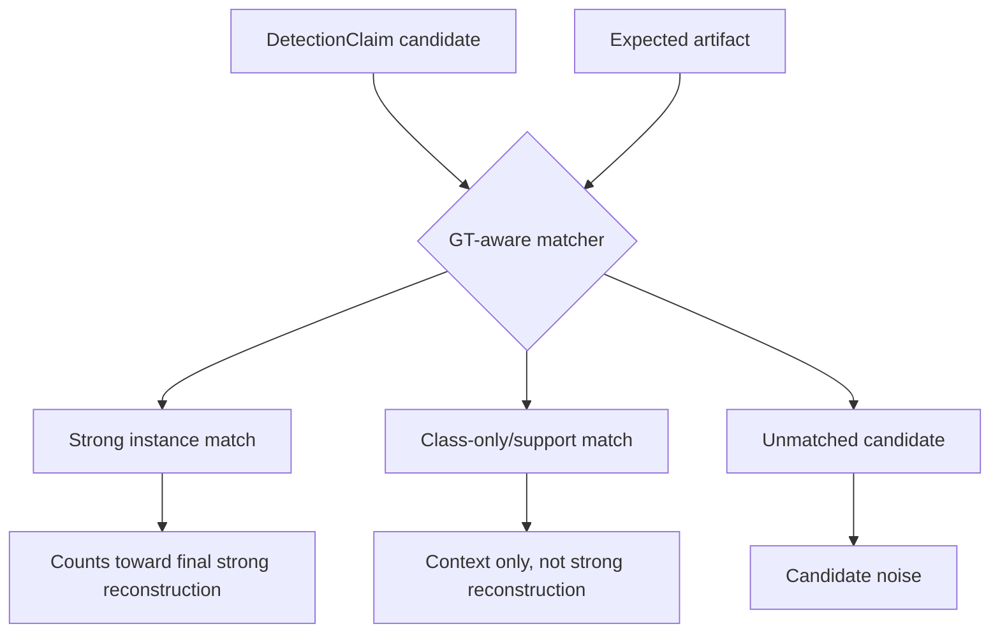

# Metrics Methodology Review

This document reviews current metric semantics in the canonical/declarative
pipeline. It is intentionally critical: the current metrics are useful, but not
all of them are final thesis-quality definitions.

## Evidence Layers and Metric Roles

Keep these layers distinct. Every metric must name which layer it scores.

- Raw findings: `ToolFinding` records. Broad raw evidence. Never a headline
  metric.
- Candidate evidence: `DetectionClaim` records. GT-blind candidate/supporting
  evidence. Scored only by diagnostics.
- Class-only support: class-level matches. Useful context, reported separately,
  not counted as strong reconstruction.
- Strong instance reconstruction: instance-level matches between an expected
  artifact and a candidate. This is the thesis reconstruction signal.
- Thesis headline metrics: computed over strong instance reconstruction, with
  class-only support reported separately.
- Diagnostic metrics: candidate-level precision/recall and per-source/per-class
  breakdowns. Useful for tuning, not headline claims.

Headline metrics must not silently score raw findings or all candidate claims as
final reconstruction.

## Current Matching Outcomes

For the current Father validation:

| metric | value |
|---|---:|
| raw `ToolFinding` records | 7608 |
| `DetectionClaim` records | 255 |
| candidate TP | 10 |
| candidate FP | 245 |
| candidate FN | 0 |
| candidate precision | 0.0392 |
| candidate recall | 1.0000 |
| strong instance matches | 7 |
| class-only/support matches | 3 |
| strict candidate-stream precision | 0.0275 |
| strong instance recall | 0.7000 |

## Candidate-Level Precision and Recall

Current location: `metrics.json` keys `micro` and `candidate_diagnostics`.

Formula:

- precision = candidate TP / (candidate TP + unmatched candidates)
- recall = candidate TP / (candidate TP + missed expected artifacts)

Important caveat: candidate TP currently includes both strong instance matches
and class-only/support matches.

This metric is useful for detector-layer diagnostics. It is not a final thesis
reconstruction quality metric because `DetectionClaim` is candidate/supporting
evidence, not a final result.

For Father:

- precision = 10 / (10 + 245) = 0.0392
- recall = 10 / (10 + 0) = 1.0000

The high recall means every expected artifact received at least some candidate
match. It does not mean every artifact was concretely reconstructed.

## Strong Reconstruction and Candidate-Stream Precision

Current location: `metrics.json` key `final_reconstruction`.

The current schema is `forensic-lab.matcher.metrics.v2`. Older draft/v1 metric
shapes are not thesis methodology and should be regenerated with the current
matcher instead of silently displayed as canonical metrics.

Current `final_reconstruction` formula:

- strong TP = instance-level matches
- support = class-only matches
- FP = unmatched candidates + class-only/support matches
- FN = expected artifacts not covered by strong instance matches
- precision = strong TP / (strong TP + FP), labeled in CLI/reporting as strict
  candidate-stream precision, not a headline reconstruction precision metric
- recall = strong TP / (strong TP + FN)

For Father:

- strong TP = 7
- class-only/support = 3
- unmatched candidates = 245
- FP = 245 + 3 = 248
- FN = 10 - 7 = 3
- strict candidate-stream precision = 7 / (7 + 248) = 0.0275
- recall = 7 / (7 + 3) = 0.7000

This is conservative and correctly prevents class-only support from inflating
headline reconstruction quality.

Important caveat: this precision denominator still includes unmatched candidate
claims. It is therefore a strict candidate-stream precision diagnostic, not a
pure final reconstruction precision. The thesis headline should use strong
instance reconstruction recall/coverage, class-only support coverage, source
coverage, corroboration, and noise reduction.

## Evidence Coverage

No pinned `evidence_coverage` key is currently emitted.

Closest current fields:

- `reconstruction.class_level_recall`: class-level coverage, currently 10/10.
- `reconstruction.instance_only_recall`: strong instance coverage, currently
  7/10.
- `final_reconstruction.recall`: same strong-instance recall, currently 0.7000.
- `critical_recall`: candidate-level recall over critical expected artifacts,
  currently 5/5.

Methodological assessment:

- Strong-instance coverage is defensible as "expected artifacts reconstructed at
  concrete instance level."
- Class-level coverage is useful as context, but too weak for headline claims.
- Critical recall is useful but currently candidate-level; it can include
  class-only support.

Recommended later implementation: add an explicit `evidence_coverage` metric
with separate `strong_instance`, `class_support`, and `critical_strong_instance`
fields.

## Source Coverage

A pinned `source_coverage` key is now emitted (schema
`forensic-lab.matcher.metrics.v2`): its numerator is strong-reconstruction
sources and its denominator is available raw-finding sources. Related fields:

- `source_breakdown`: raw `ToolFinding` counts by source.
- `per_source`: candidate-level precision/recall/F1 grouped by source.
- report sections showing raw counts and claim counts by source.

For Father, `source_breakdown` is:

| source | raw findings |
|---|---:|
| disk | 32 |
| memory | 4112 |
| timeline | 3464 |
| log | 0 |
| unknown | 0 |

Methodological assessment:

- Raw source availability is defensible.
- Per-source candidate PRF is diagnostic, but can be misleading because
  expectations can be eligible for multiple sources and one matched candidate
  can be counted in more than one source perspective.
- A thesis source coverage metric should distinguish "source was available",
  "source produced candidates", and "source contributed strong instance
  reconstruction."

Recommended later implementation: define source coverage over matched
expectations and linked `source_findings`, not over raw detector output alone.

## Noise Reduction Ratio

A pinned `noise_reduction` key is now emitted (schema
`forensic-lab.matcher.metrics.v2`). It reports raw-to-candidate and
raw-to-strong-reconstruction count reduction only and is explicitly not
baseline-aware. The derivation is:

- raw findings = 7608
- candidate claims = 255
- reduction = 1 - (255 / 7608) = 0.9665

Methodological assessment:

This number is useful but incomplete. It measures reduction from broad raw
evidence to candidate evidence. It does not measure reduction after baseline
comparison because baseline-aware filtering is not currently implemented in the
canonical path.

Recommended later implementation: report multiple reduction stages:

- raw findings -> candidate claims
- candidate claims -> matched candidates
- raw findings -> strong reconstruction evidence
- later, baseline-filtered findings -> candidate claims

## Pipeline Runtime Seconds

No pinned `pipeline_runtime_seconds` key is currently emitted by the canonical
matcher metrics.

The acquisition manifest does contain acquisition timings:

- memory acquisition seconds: 2.4131500720977783
- disk acquisition seconds: 15.461720705032349

Those are not the same as full pipeline runtime. They exclude at least detector
and matcher runtime, and may not fully represent extraction/runtime cost.

Methodological assessment:

Do not infer pipeline runtime from file timestamps. The current code should not
claim a full post-mortem pipeline runtime metric.

Recommended later implementation: add a small canonical timing summary only
after deciding which phases belong in the runtime definition.

## Observability Gap Rate

No pinned `observability_gap_rate` key is currently emitted.

The ingredients are partially present:

- `ArtifactExpectation.observability`
- `source_eligibility`
- `MatchResult` relation and match level
- strong vs class-only distinction

Current limitation: there is no reason-code taxonomy for why an expectation was
missed at strong instance level. For Father, candidate-level FN is zero, but
strong-instance misses are three. These are not represented as observability
gaps with reasons.

Recommended later implementation: postpone unless the thesis needs it. If
added, derive it from unmatched or weakly matched expected artifacts grouped by
`observability` and `source_eligibility`.

## Methodological Assessment

Defensible now:

- Candidate-level diagnostics are clearly labeled.
- Strong instance matches are separated from class-only support.
- Raw finding fallback is excluded from normal thesis reporting.
- The report now shows enough layers to explain where noise enters.

Questionable now:

- `final_reconstruction.precision` is conservative but semantically overloaded
  because unmatched candidate claims are in its denominator; CLI/report output
  should label it as strict candidate-stream precision.
- Source coverage is not yet a clean thesis metric.
- Evidence coverage exists only as partial recall fields.
- Critical recall can still hide weak class-only support.
- Noise reduction is derivable but not formalized and not baseline-aware.

Recommended next metric cleanup:

1. Define the final reconstruction set explicitly in prose.
2. Keep `final_reconstruction.precision` clearly labeled as strict
   candidate-stream precision unless a real final-claim selection layer is
   added.
3. Add explicit pinned metric keys only after definitions are stable.
4. Add source/evidence coverage over strong instance matches first.
5. Leave baseline-aware filtering for a separate implementation patch.

## Thesis Headline Metrics (Next Implementation)

The next implementation should prioritize these headline metrics, all computed
over strong instance reconstruction unless stated otherwise:

1. strong instance reconstruction recall / coverage;
2. class-only support coverage, reported separately (not folded into headline
   recall);
3. source coverage over strong instance matches;
4. multi-source corroboration over strong instance matches;
5. noise reduction;
6. pipeline runtime only if explicitly measured (do not infer from file
   timestamps).

Claim precision is postponed. Until there is a real final-claim selection layer,
claim precision is undefined as a headline metric: unmatched candidate claims are
detector noise rather than rejected final claims. Current candidate
precision/recall stay diagnostics only, and `final_reconstruction.precision`, if
still emitted, is not a clean thesis headline metric because unmatched candidate
claims remain in its denominator.
